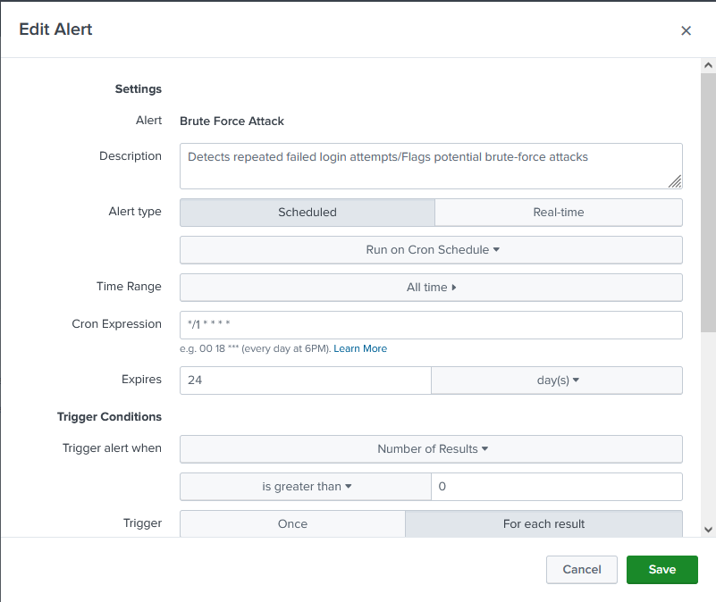
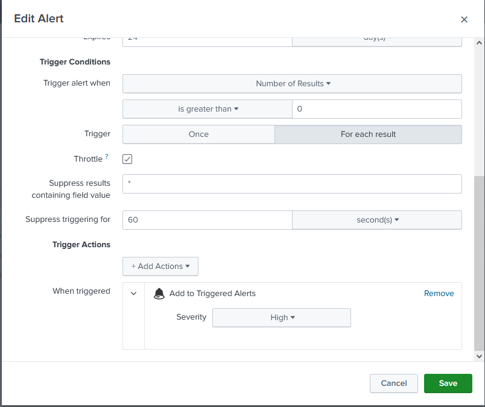
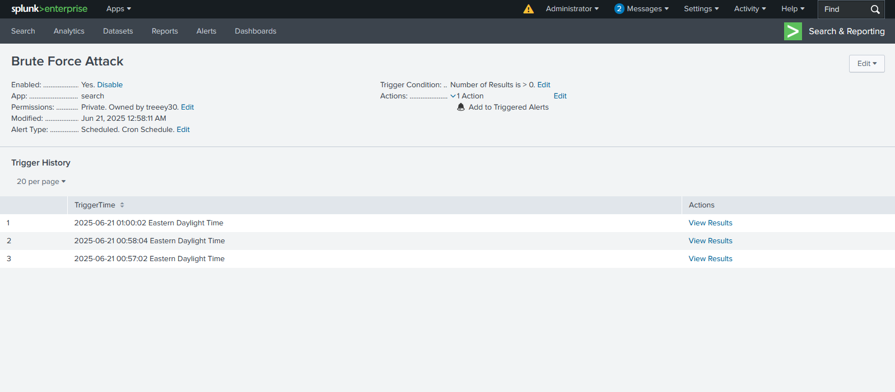

# 🔐 Splunk Alert: Brute Force Login Detection (Event ID 4625)
🧠 Alert Purpose
Detects potential brute-force attacks by identifying repeated failed login attempts (Event ID 4625). These attempts may signal unauthorized access efforts or account enumeration.

🔍 Search Query
spl
index="splunk_homelab" | spath EventID | search EventID=4625
⏰ Scheduling & Trigger Conditions
Alert Type: Scheduled

Cron Schedule: */1 * * * * (Runs every 15 minutes)

Time Range: All time (for static data set testing)

Trigger Condition: Number of results > 0

Trigger Mode: Once

Suppression: (optional) by user or src_ip if needed

🚨 Alert Actions

✅ Add to Triggered Alerts

📊 Use Case Relevance
Event ID 4625 logs failed login attempts and is a classic signal in brute-force, password spraying, or enumeration attempts. This alert helps simulate real-world SOC behavior.

Use this to:

Practice correlating failed login spikes with source IPs

Demonstrate SIEM alert logic

Build dashboards and response documentation

# 🖼️ Screenshots

