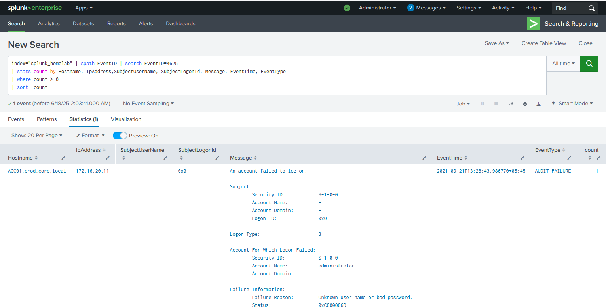
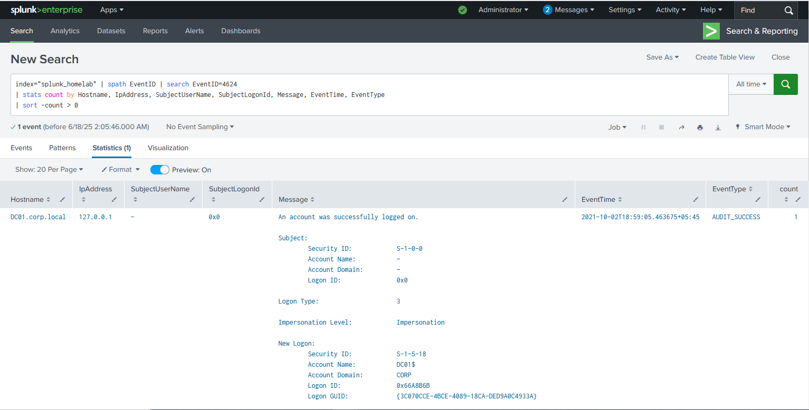
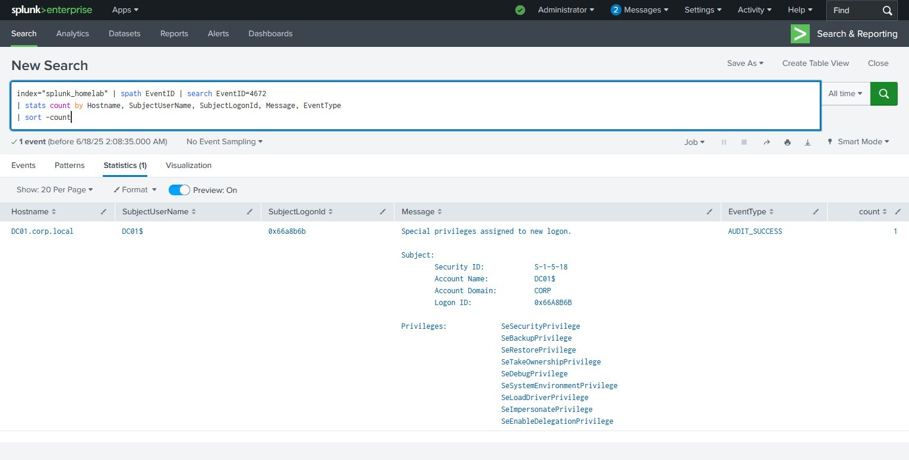
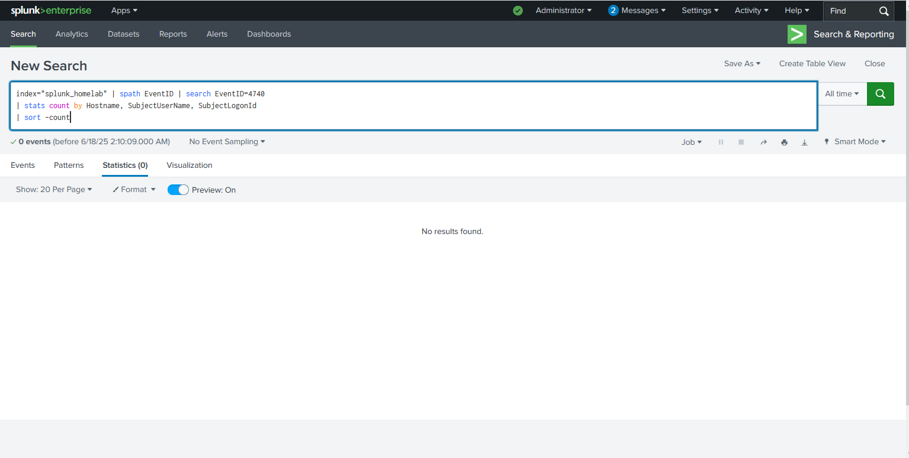
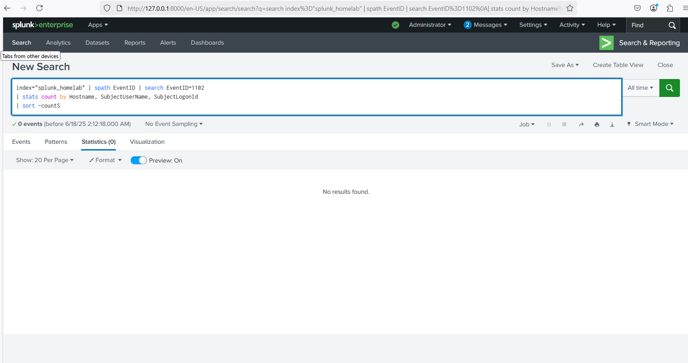
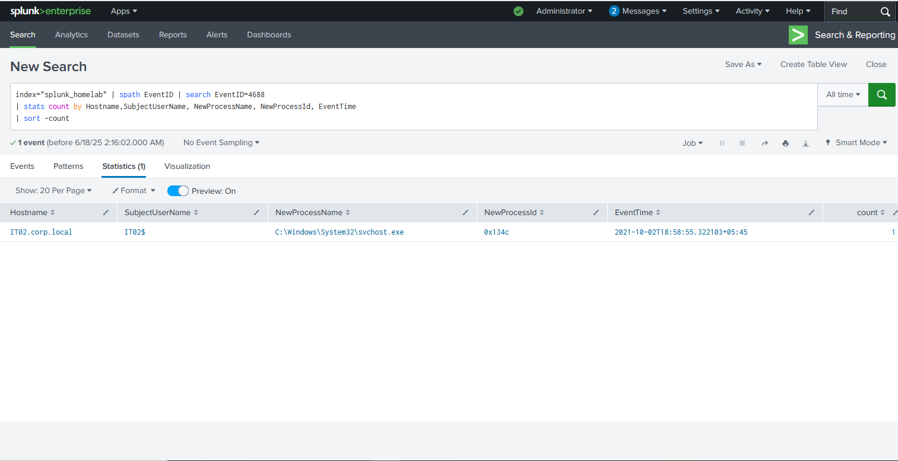

# Splunk Queries Results

1. index="splunk_homelab" | spath EventID | search EventID=4625 
| stats count by Hostname, IpAddress, SubjectUserName, SubjectLogonId, Message, EventTime, EventType
| where count > 0 
| sort -count
(Detects repeated failed login attempts/Flags potential brute-force attacks)

2. index="splunk_homelab" | spath EventID | search EventID=4624 
| stats count by Hostname, IpAddress, SubjectUserName, SubjectLogonId, Message, EventTime, EventType 
| sort -count > 0
(Monitors successful logins per user & IP)

4. index="splunk_homelab" | spath EventID | search EventID=4672 
| stats count by Hostname, SubjectUserName,  SubjectLogonId, Message, EventType
| sort -count
(Identifies accounts gaining special privileges)

6. index="splunk_homelab" | spath EventID | search EventID=4740 
| stats count by Hostname, SubjectUserName, SubjectLogonId
| sort -count
(Tracks accounts locked due to multiple failed login attempts)

8. index="splunk_homelab" | spath EventID | search EventID=1102
| stats count by Hostname, SubjectUserName, SubjectLogonId
| sort -count
(Flags when security logs are cleared/threat actor is trying to cover tracks)

10. index="splunk_homelab" | spath EventID | search EventID=4688 
| stats count by Hostname,SubjectUserName, NewProcessName, NewProcessId, EventTime
| sort -count
(Monitors process executions for suspicious activity)

